# Develop Cloud Native Applications with IBM Cloud Pak for Applications

- [1. Introduction](#1-introduction)
  * [1.1. About the lab](#11-about-the-lab)
  * [1.2. Complementary labs](#12-complementary-labs)
  * [1.3. High-Level Architecture](#13-high-level-architecture)
- [2. Getting Started](#2-getting-started)
  * [2.1. About the lab environment](#21-about-the-lab-environment)
    + [2.1.1 The "Workstation" virtual machine](#211-the--workstation--virtual-machine)
  * [2.2. Red Hat OCP console and command-line interface](#22-red-hat-ocp-console-and-command-line-interface)
    + [2.2.1. Logging into the Red Hat OCP console](#221-logging-into-the-red-hat-ocp-console)
    + [2.2.2. Logging into the Red Hat OpenShift command-line interface](#222-logging-into-the-red-hat-openshift-command-line-interface)
    + [2.2.3. Patching the lab environment](#223-patching-the-lab-environment)
  * [2.3. Cloud Pak Console](#23-cloud-pak-console)
  * [2.4. ­Application stacks](#24--application-stacks)
    + [2.4.1. Using application stack hubs](#241-using-application-stack-hubs)
    + [2.4.1. Creating your own application stack hub](#241-creating-your-own-application-stack-hub)
- [3. Deploying the microservices](#3-deploying-the-microservices)
  * [3.1. Set up the deployment environment](#31-set-up-the-deployment-environment)
  * [3.2. Set up the OpenShift project](#32-set-up-the-openshift-project)
  * [3.3. Create application configuration](#33-create-application-configuration)
  * [3.4. Building the application](#34-building-the-application)
    + [3.4.1. Building and pushing the image to a container registry](#341-building-and-pushing-the-image-to-a-container-registry)
  * [3.5. Deploying the application](#35-deploying-the-application)
    + [3.5.1. Using "appsody deploy"](#351-using--appsody-deploy-)
    + [3.5.2. Inspect results of deployment](#352-inspect-results-of-deployment)
    + [3.5.3. (optional section) Using the OpenShift command-line interface](#353--optional-section--using-the-openshift-command-line-interface)
    + [3.5.4. Using pipelines](#354-using-pipelines)
      - [3.5.4.1. Using a webhook](#3541-using-a-webhook)
      - [3.5.4.2. Tekton dashboard](#3542-tekton-dashboard)
      - [3.5.4.3. Triggering manual runs](#3543-triggering-manual-runs)
- [4. Monitoring the microservices](#4-monitoring-the-microservices)
  * [4.1. OpenShift Service Mesh](#41-openshift-service-mesh)
  * [4.2. Configure the ingress for the deployed service](#42-configure-the-ingress-for-the-deployed-service)
    + [4.2.1. Patch for Appsody Operator issue (already fixed upstream)](#421-patch-for-appsody-operator-issue--already-fixed-upstream-)
    + [4.2.2. Routing inbound traffic to the application via Service Mesh](#422-routing-inbound-traffic-to-the-application-via-service-mesh)
  * [4.3. Kiali console](#43-kiali-console)
  * [4.4. Jaeger console](#44-jaeger-console)
- [5. Conclusion](#5-conclusion)


# 1. Introduction

The [IBM Cloud Pak for Applications](https://www.ibm.com/cloud/cloud-pak-for-applications) includes a wide range of runtime platforms, supporting a flexible progression of development techniques and deployment architectures, from traditional WebSphere Application Server workloads to serverless microservices running in a Kubernetes environment.

The conceptual overview in Figure 1 shows the core platforms and components bundled with the Cloud Pak. This lab explores the development process for serverless microservices the latest runtime capabilities in the Red Hat OpenShift Container Platform (OCP), such as the Red Hat Service Mesh (based on the Istio service mesh). Refer to sub-section [1.2](#12-complementary-labs) (["Complementary labs"](#12-complementary-labs)) for suggestions of other labs covering components not covered in this lab.

  
**Figure 1 - Components and runtimes bundled with IBM Cloud Pak for Applications**


## 1.1. About the lab

This lab was created to engage the participant in an interactive tour of the product development cycle built into the Cloud Pak for Applications. The exercises are built to be brief while also showing the potential for further exploration after the lab with links to more in-depth guides and tutorials.

The lab's focus is on the "Accelerator for Teams" component of the Cloud Pak for Applications and on the OpenShift Container Platform. The "Accelerator for Teams" component is centered around the creation of microservices built atop "application stacks" of software, which abstracts many complicated aspects of application deployment while also offering consistent runtimes to support governance requirements.

Given the 2-hour time slot available for the lab and the many other labs already covering the application development model in great detail, this lab is focused on the packaging, deployment, and operational aspects of the Cloud Pak for Applications.

If you like the specific code examples used in this lab and want to go through code changes step-by-step, you can follow the self-paced tutorial "Distributed tracing for microservices, Part 1", located at [https://developer.ibm.com/tutorials/distributed-tracing-for-microservices-1/](https://developer.ibm.com/tutorials/distributed-tracing-for-microservices-1/).


## 1.2. Complementary labs

For a broader view of the capabilities of the Cloud Pak for Applications, check lab **"6969 – A Deep Dive on IBM Cloud Pak for Applications".**

For an in-depth view into the application modernization portion of the Cloud Pak for Applications, check lab " **1305 How to make Liberty your destination for Migration, Modernizing and new Microservices".**

For a demonstration of development using the hosted coding capabilities built into CodeReady Workspaces, check lab " **1751 Develop Your Kube-App from Zero to Hero with CodeReady Workspaces and Codewind".**

After this lab, you can continue your experience with Cloud Pak for Applications through these self-paced hands-on labs at [https://www.ibm.com/demos/collection/Cloud-Pak-for-Applications/](https://www.ibm.com/demos/collection/Cloud-Pak-for-Applications/), using a self-service reservation system to have access to a real environment and step-by-step instructions.


## 1.3. High-Level Architecture

You will build a small microservice architecture using different programming languages and runtime frameworks, all based on the "Accelerator for Teams" component of the Cloud Pak. That architecture is illustrated in Figure 2.

  
**Figure 2 - Microservice architecture for the lab exercise**


# 2. Getting Started

Before starting with the exercises, you need a couple of minutes to familiarize yourself with the lab environment.


## 2.1. About the lab environment

Each environment is created from a template that is self-contained with everything needed for this lab, including Virtual Machines (VMs), storage, and networking, as depicted in Figure 3.

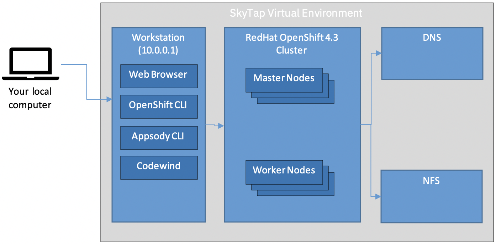  
**Figure 3 - "Air-gapped" lab environment**

Access to the environment is initiated via web-browser from your local computer to the workstation inside the virtual environment. VMs in the environment do not have an external network port, so you cannot access applications hosted in the RedHat OpenShift cluster directly from a client on your machine.

Once you launch your environment, you will see a screen similar to the one in Figure 4, with a control tile corresponding to each virtual machine.

**Important** : Familiarize yourself with the environment instructions, located at [https://help.skytap.com/SmartClient\_Help\_Page.html](https://help.skytap.com/SmartClient_Help_Page.html), which contains information for first-time users of the environment as well as common troubleshooting steps, such as locating credentials and performing simple activities like scaling the remote desktop to match your screen settings and using the clipboard between your local workstation and the remote environment.

  
**Figure 4 - Control screen for the lab environment**

All virtual machines should be in a "Running" state before starting the lab exercise, but if for whatever reason you see one of them in a "Suspended" or "Powered off" state before the lab starts, click on the "Play"  button in the area immediately above the tiles to start all virtual machines that are not, as seen in Figure 5. Using the individual controls in a tile is not advised as it is recommended that the virtual machines are started in a pre-programmed order that is already observed by the global "Play" button.

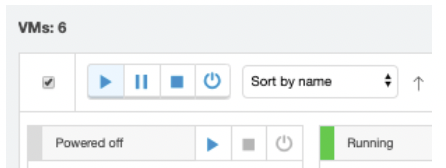  
**Figure 5 - Controls for virtual machines**

**Important**: Starting up all VMs takes up to 10 minutes, so you should make sure they are all in that "Running" state **before the lab starts**.

### 2.1.1 The "Workstation" virtual machine

You will use the "Workstation" virtual machine for the entirety of this lab. Click on the "Workstation" tile, which will launch a full desktop containing all the tools required to complete the exercises, as seen in Figure 6.

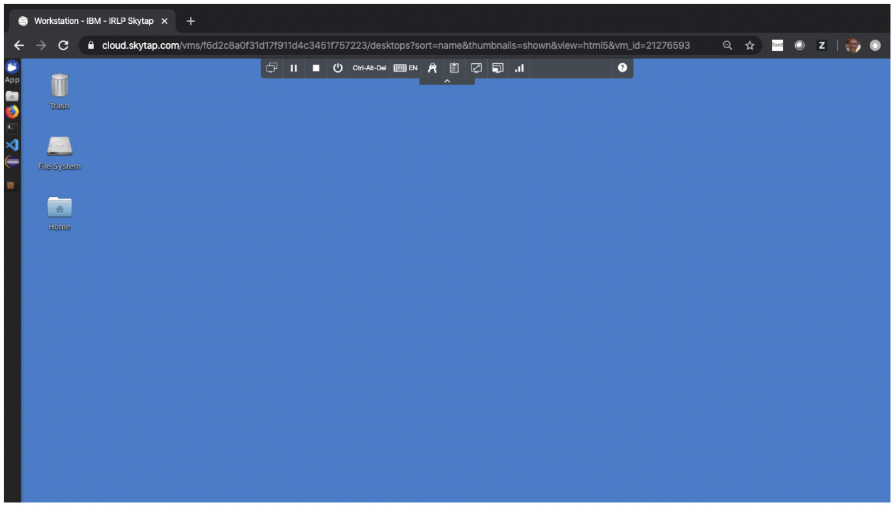  
**Figure 6 - Remote workstation desktop for this lab**

Familiarize yourself with the browser client toolbar at the top of the screen, which is explained in more detail at [https://help.skytap.com/VMClient.html](https://help.skytap.com/VMClient.html).

Also, notice the launch icons in the left launch bar. The Firefox and Terminal icons are going to be used quite frequently in this lab.

## 2.2. Red Hat OCP console and command-line interface

This lab requires access to the OCP console and command-line interfaces. The focus of the lab is not on those tools, but you are encouraged to attempt the excellent tutorials in the Red Hat Interactive Learning Portal, at [http://learn.openshift.com/](http://learn.openshift.com/), containing short labs where you can learn and explore the full capabilities of these resources.

The console is bookmarked in the "Bookmarks" bar of the web-browser, and can also be accessed with this URL:

[https://console-openshift-console.apps.demo.ibmdte.net/](https://console-openshift-console.apps.demo.ibmdte.net/)


### 2.2.1. Logging into the Red Hat OCP console

If prompted to log in to the OCP console, click on "httpasswd" and accept the default password for the user "ibmadmin" (see Figure 7).

  
**Figure 7 - Login prompt for the OCP console**


### 2.2.2. Logging into the Red Hat OpenShift command-line interface

Once you log into the OCP console, select "Copy Login Command" from the drop-down menu under the user name in the upper-right corner of the console, as seen in Figure 8.

  
**Figure 8 - Obtaining the login command for the "oc" command-line**

Select "Display Token" and copy-paste the command under "Log in with this token" to a terminal.

Accept any eventual prompt about "Use insecure connections", which is specific to this air-gapped environment. Actual production environments would have valid certificates in front of the OpenShift API endpoint and would not ask you about accepting untrusted certificates.


### 2.2.3. Patching the lab environment

The environment may have outstanding certificate signing requests depending on the timing between the provisioning of the environment and the actual time the VMs are started. To ensure there are no outstanding requests, log in to the command-line interface according to the previous section and enter the following command on a terminal:

```sh
oc get csr -o name | xargs oc adm certificate approve
```

Additionally, the "elasticsearch" component may have an older version still being resolved after the cluster starts. This older version may delay the progress of the later sections of the lab, so you need to manually delete it by entering the following command in a terminal:

```sh
oc delete ClusterServiceVersion elasticsearch-operator.4.3.5-202003020549 \
--ignore-not-found=true \
-n openshift-operators
```


## 2.3. Cloud Pak Console

You can reach the Cloud Pak for Applications console using the corresponding launch icon in the OCP console:

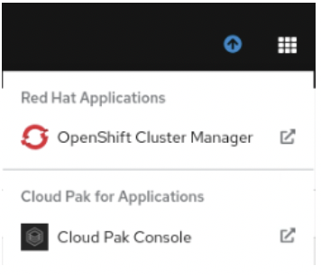

From the Cloud Pak console, you can locate important resources, such as links to installing additional features, Knowledge Center, instance management, and guides (Figure 9).

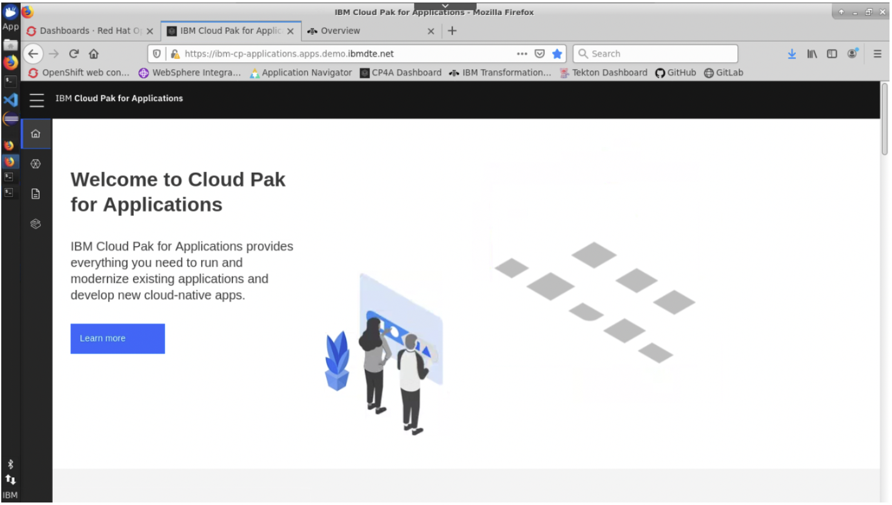  
**Figure 9 - Cloud Pak for Applications landing page**


## 2.4. ­Application stacks

An application stack is a combination of runtime container image, runtime framework, toolsets for the runtime, and application code templates, as illustrated in Figure 10.

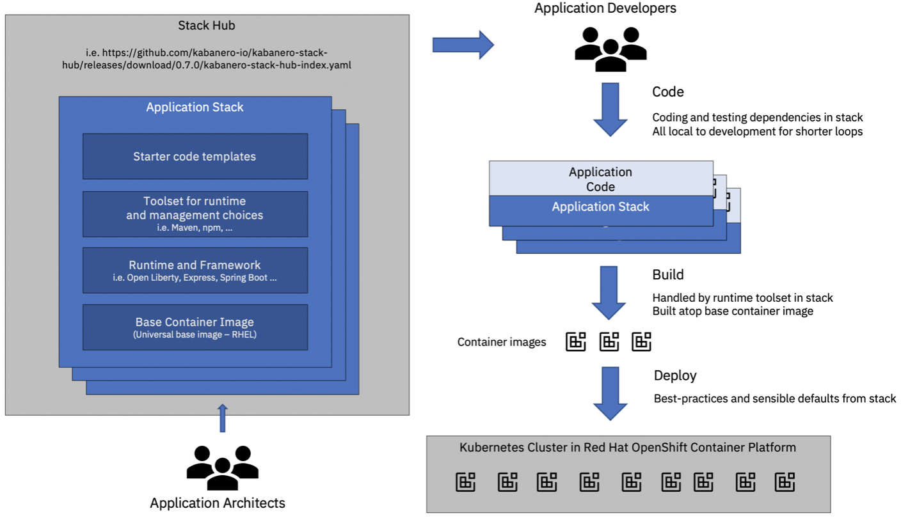  
**Figure 10 - Application stacks and stacks hub**

When an application is created from an application stack, it inherits all the choices and solutions already included in the stack, which not only enables faster bring-up times for development environments, but also means these applications are automatically improved as the stack improves.


### 2.4.1. Using application stack hubs

This lab does not focus on the actual lines of code inside each application, but it will show a bit of the development workflow required to create a new application.

For instance, you can list all application hubs available for application development entering the following command in a terminal:

```sh
appsody repo list
```

This command should produce output similar to this:

```
NAME URL

*incubator https://github.com/appsody/stacks/releases/latest/download/incubator-index.yaml
experimental https://github.com/appsody/stacks/releases/latest/download/experimental-index.yaml
```

You can register new application stack hubs and list their contents with commands similar to the ones below (note that the version of the hub will increase over time) :

```sh
appsody repo add kabanero https://github.com/kabanero-io/kabanero-stack-hub/releases/download/0.7.0/kabanero-stack-hub-index.yaml

appsody list kabanero
```

These commands should produce output similar to the one below:

```
REPO ID                     VERSION  TEMPLATES          DESCRIPTION
kabanero java-microprofile  ...      *default           ...
kabanero java-openliberty   ...      *default           ...
kabanero java-spring-boot2  ...      *default, kotlin   ...
kabanero nodejs             ...      *simple            ...
kabanero nodejs-express     ...      scaffold, *simple  ...
```

As an example, you can create a new application based on one of the application stacks and run it locally without the pre-installation of any development tooling or runtime for testing, entering the following commands:

```sh
mkdir /tmp/nodejs-app
cd /tmp/nodejs-app

appsody init kabanero/nodejs-express

appsody run
```

Now open another terminal and enter the following command to check the result of the running application in the advertised port:

```sh
curl localhost:3000
```

This command should produce the following output:

```
Hello from Appsody!
```

Now stop the application hitting `Ctrl+C` in the terminal from where it was launched or entering the following commands on another terminal:

```sh
cd /tmp/nodejs-app
appsody stop
```

If you want to take on the full experience of developing code with the appsody CLI, you can take a look at the various development guides covering application development in the "Guides" section of the Cloud Pak for Applications Console.


### 2.4.1. Creating your own application stack hub

The creation of new application stacks is beyond the scope of this lab, but there are great self-paced resources where you can further explore them:

- "Cloud Native Use Case: Enable Governance on App Development with IBM Cloud Pak for Applications Stack Management" hands-on lab: [https://www.ibm.com/cloud/garage/dte/tutorial/cloud-native-use-case-enable-governances-app-development-ibm-cloud-pak-applications](https://www.ibm.com/cloud/garage/dte/tutorial/cloud-native-use-case-enable-governances-app-development-ibm-cloud-pak-applications)
- "Working with application stacks": [https://kabanero.io/guides/working-with-stacks/](https://kabanero.io/guides/working-with-stacks/)

- "Creating a stack hub": [https://kabanero.io/guides/creating-a-stack-hub/](https://kabanero.io/guides/creating-a-stack-hub/)


# 3. Deploying the microservices


## 3.1. Set up the deployment environment

Clone the modified code from the baseline GitHub repositories for this lab, using the following instructions:

```sh
mkdir -p /home/ibmdemo/cp4a-labs/think20

cd /home/ibmdemo/cp4a-labs/think20
git clone https://github.com/think-2020-cp4a/service-a.git
cd service-a
git checkout v1

cd /home/ibmdemo/cp4a-labs/think20
git clone https://github.com/think-2020-cp4a/service-b.git
cd service-b
git checkout v1

cd /home/ibmdemo/cp4a-labs/think20
git clone https://github.com/think-2020-cp4a/service-c.git
cd service-c
git checkout v1
```


## 3.2. Set up the OpenShift project

You will create a new OpenShift project, which amongst other things, maps to a Kubernetes namespace. A separate project ensures that your application objects are isolated from other resources, avoiding overlaps and minimizing accidental overwrites when executing the steps of this lab.

```sh
oc new-project cloudlab
```

If you see a message like the one below, that means you need to log in to the Red Hat OCP console and command-line interface first, following the instructions in section [2.2](#221-logging-into-the-red-hat-ocp-console) (["Red Hat OCP console and command-line interface"](#221-logging-into-the-red-hat-ocp-console)) and then trying the failed command again.

`error: You must be logged in to the server (Unauthorized)`


## 3.3. Create application configuration

The applications in this lab generate distributed tracing information that can be analyzed in the next major section. That information is stored in a backend that needs to be reached by the applications and that connectivity information is expected from a `ConfigMap` object named "jaeger-config" in the same "cloudlab" namespace where the applications will be deployed

Create a `ConfigMap` ([https://kubernetes.io/docs/tasks/configure-pod-container/configure-pod-configmap/#create-a-configmap](https://kubernetes.io/docs/tasks/configure-pod-container/configure-pod-configmap/#create-a-configmap)) object informing the applications about the sampling rates and destination for distributed tracing information generated:

```
cat<<EOF | oc apply -n cloudlab -f -
apiVersion: v1
kind: ConfigMap
metadata:
  name: jaeger-config
data:
  JAEGER_ENDPOINT: http://jaeger-collector.istio-system.svc.cluster.local:14268/api/traces
  JAEGER_PROPAGATION: b3
  JAEGER_REPORTER_LOG_SPANS: "true"
  JAEGER_SAMPLER_PARAM: "1"
  JAEGER_SAMPLER_TYPE: const
EOF
```

You should see a success message indicating that the `configmap/jaeger-config` object was created.


## 3.4. Building the application

You need to ensure the entire application stack can be built into a valid container image before attempting a deployment to a cluster. Once you know your code can be built correctly into a container image, without compilation or execution errors, you have several options to deploy the code, which will be covered in the next sections.

You will use the `build` command of the appsody command-line interface on each directory to create the container image for each microservice. You may want to use one terminal (or tab in a terminal) per microservice to expedite the process.

The `build` command can be used without parameters to create an image in a local Docker container registry, but it also pushes the image to a remote container registry once the build is complete. To save time in this lab, you will use build parameters that push the image directly to the container registry in the OCP, where they will be used in later steps of the lab.

OCP does not expose its image registry outside the cluster by default, mostly to ensure good deployment and security practices. The instructions for exposing the registry the are available in the OCP documentation at: https://docs.openshift.com/container-platform/4.3/registry/architecture-component-imageregistry.html .

Expose the container registry and log in to it entering the following instructions based on the contents of the previous URL:

```sh
oc patch configs.imageregistry.operator.openshift.io/cluster --patch '{"spec":{"defaultRoute":true}}' --type=merge

HOST=$(oc get route default-route -n openshift-image-registry --template='{{ .spec.host }}')

docker login -u $(oc whoami) -p $(oc whoami -t) $HOST
```


### 3.4.1. Building and pushing the image to a container registry

Push the image for service A to the container registry, entering the following commands:

```sh
HOST=$(oc get route default-route -n openshift-image-registry --template='{{ .spec.host }}')

cd /home/ibmdemo/cp4a-labs/think20/service-a

appsody build \
    --pull-url image-registry.openshift-image-registry.svc:5000 \
    --push-url $HOST/cloudlab \
    --tag service-a:1.0.0
```

Note the usage of the following parameters:

- `pull-url` is the URL of the registry namespace in the remote registry, as seen from inside the container platform
- `push-url` is the address of the remote registry as exposed to the "workstation" virtual machine
- `tag` is the name and version of the image in the registry

Also note that this step will create (or update) a file named "app-deploy.yaml" in the application directory, which contains an `AppsodyOperator` object describing the deployment and service configuration for the application.

Push the image for service B to the container registry, entering the following commands:

```sh
HOST=$(oc get route default-route -n openshift-image-registry --template='{{ .spec.host }}')

cd /home/ibmdemo/cp4a-labs/think20/service-b

appsody build \
    --pull-url image-registry.openshift-image-registry.svc:5000 \
    --push-url $HOST/cloudlab \
    --tag service-b:1.0.0
```

Push the image for service C to the container registry, entering the following commands:

```sh
HOST=$(oc get route default-route -n openshift-image-registry --template='{{ .spec.host }}')

cd /home/ibmdemo/cp4a-labs/think20/service-c

appsody build \
    --pull-url image-registry.openshift-image-registry.svc:5000 \
    --push-url $HOST/cloudlab \
    --tag service-c:1.0.0
```

You can enter the following command to inspect the results of all builds after they are completed:

```sh
docker images default-route-openshift-image-registry.apps.demo.ibmdte.net/cloudlab/*
```

The command should produce results similar to the one below:

```
REPOSITORY TAG IMAGE ID CREATED SIZE
default-route-openshift-image-registry.apps.demo.ibmdte.net/cloudlab/service-a 1.0.0 ... About a minute ago 1.06GB
default-route-openshift-image-registry.apps.demo.ibmdte.net/cloudlab/service-c 1.0.0 ... 3 minutes ago 709MB
default-route-openshift-image-registry.apps.demo.ibmdte.net/cloudlab/service-b 1.0.0 ... 3 minutes ago 408MB
```

As an extra example of the usage of the "appsody build" command to publish images to a remote repository, the images for this lab were pushed to https://hub.docker.com/orgs/think20cp4a/repositories using the commands below:

```
# Don't execute these commands, they are examples and you don't have 
# permissions to publish images to the target repository.

# appsody build --push-url think20cp4a --tag service-a:1.0.0
# appsody build --push-url think20cp4a --tag service-b:1.0.0
# appsody build --push-url think20cp4a --tag service-c:1.0.0
```


## 3.5. Deploying the application

There are multiple options to deploy the application to OCP, namely:

1. Using the appsody deploy command directly from the source code directory
2. Using the OpenShift command-line, referencing the images in a container registry
3. (preferred) Using the continuous integration pipelines deployed with Cloud Pak for Applications


### 3.5.1. Using "appsody deploy"

The `appsody deploy` alternative is useful during the development cycle of an application, especially when paired with a local cluster such as the built-in Kubernetes cluster in "Docker Desktop" or "minikube", but deployment from a developer's workstation is typically blocked in clusters meant for production workloads.

The deploy command creates a new deployment in the target cluster, configuring its pods to pull the image from a specified location. You can use different terminals for each microservice to expedite this step.

Deploy the image for service A to the container registry, entering the following commands:

```sh
cd /home/ibmdemo/cp4a-labs/think20/service-a

appsody deploy \
    --no-build \
    --namespace cloudlab
```

Note the usage of the following parameters:

- `no-build` indicates a new build is not necessary since you have not made changes to the code since the last build was pushed to the container registry
- `namespace` is the Kubernetes namespace where the resulting application will be deployed

Also note that you can remove the `--no-build` parameter from the invocation and add back the `--push-url` and `--pull-url` parameters to implicitly invoke the "build" step seen in the previous section.

Deploy the image for service B to the container registry, entering the following commands:

```sh
cd /home/ibmdemo/cp4a-labs/think20/service-b

appsody deploy \
    --no-build \
    --namespace cloudlab
```

Build, push, and deploy the image for service C to the container registry, entering the following commands:

```sh
cd /home/ibmdemo/cp4a-labs/think20/service-c

appsody deploy \
    --no-build \
    --namespace cloudlab
```

Once you have all deployment requests in progress, you can jump to the next section to see the processes in progress.


### 3.5.2. Inspect results of deployment

You can inspect the results of the deployment operations from either the command-line interface or from the OCP console.

The `appsody deploy` command generates an `AppsodyApplication` object for each application, which is contained in a file named "app-deploy.yaml" in the application directory. These objects are processed by the [Appsody operator](https://github.com/appsody/appsody-operator) and described in detail in the [operator's documentation page](https://github.com/appsody/appsody-operator/tree/master/doc).

You can see results from the command line entering the following commands:

```sh
oc get AppsodyApplication -n cloudlab -w
```

This command will keep continuously watching the "cloudlab" namespace in the cluster for the creation of `AppsodyApplication` objects. Once all deployments complete you should see output similar to the one below.

```
NAME IMAGE EXPOSED RECONCILED AGE
service-a image-registry.openshift-image-registry.svc:5000/cloudlab/service-a:1.0.0 true True 10m
service-b image-registry.openshift-image-registry.svc:5000/cloudlab/service-b:1.0.0 true True 12m
service-c image-registry.openshift-image-registry.svc:5000/cloudlab/service-c:1.0.0 true True 11m
```

You can also see the results in the OCP console, from either the "Developer" or "Administrator" perspective (for users with administrative privileges).

In the "Developer" perspective, switch to the "cloudlab" project using the "Advanced -> Project Details" sub-menu, then select the "cloudlab" project in the "Project" menu.

Now click on "Topology" to see the deployments, then click on "service-a" to see the right-most tab with information several aspects of the application, such as running instances, annotations, exposed service ports, and many others (Figure 11).

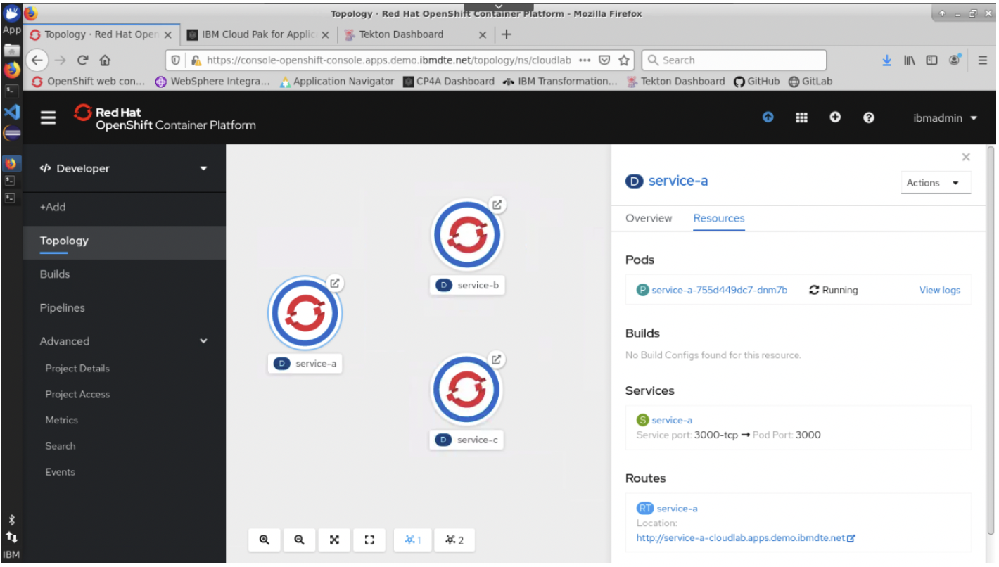  
**Figure 11 - View of new microservice deployments in "cloudlab" namespace**

Now go back to the "Administrator" perspective and select the "Workloads -> Pods" view, and ensure you have the "cloudlab" project selected in the "Project" menu. You should see the list of running pods for the deployed services (Figure 12).

  
**Figure 12 - Administrator perspective with the list of pods running the deployed microservices**

Once all the pods are up and running, you can list the public routes for all services by entering the following command:

```sh
oc get route -n cloudlab
```

The output should look similar to the one below:

```
NAME HOST/PORT SERVICES PORT ...
service-a service-a-cloudlab.apps.demo.ibmdte.net service-a 3000-tcp ...
service-b service-b-cloudlab.apps.demo.ibmdte.net service-b 8080-tcp ...
service-c service-c-cloudlab.apps.demo.ibmdte.net service-c 9080-tcp ...
```

You can verify the results by entering the following commands:

```sh
curl service-a-cloudlab.apps.demo.ibmdte.net/node-jee
curl service-a-cloudlab.apps.demo.ibmdte.net/node-springboot
```

The output should look similar to the one below:

```json
{"order":"...","total":...}
{"itemId":"...","count":...}
```

Now delete the deployments created in this section entering the following commands:

```sh
cd /home/ibmdemo/cp4a-labs/think20/service-a
appsody deploy delete --namespace cloudlab

cd /home/ibmdemo/cp4a-labs/think20/service-b
appsody deploy delete --namespace cloudlab

cd /home/ibmdemo/cp4a-labs/think20/service-c
appsody deploy delete --namespace cloudlab
```

Note that deleting the applications will not delete the container images previously pushed to the OCP container registry, which is what we want since you will still need them during the next steps.


### 3.5.3. (optional section) Using the OpenShift command-line interface

The OpenShift command-line interface allows the deployment of applications from various sources, such as GitHub URLs, image URLs, source-code in the current directory, and a few others. 

There is currently no integration between the OpenShift command-line interface and the applications built atop application stacks so that you can only use image URLs of images pushed to a registry with appsody build for now.

For that reason, the usage of the OpenShift command-line interface is considered an optional step in this lab. As a post-lab suggestion, you are encouraged to take these self-paced online classes in the [OpenShift Learning Portal](https://learn.openshift.com/introduction):

- Deploying Applications from Images
- Deploying Applications from Source

If not pressed for time, you can proceed.

For this next step, you will use the `oc new-app` command to instruct the platform to pull down the container images from a known location and create a new deployment for each image.

Enter the following commands in the terminal:

```sh
oc new-app \
    --docker-image=image-registry.openshift-image-registry.svc:5000/cloudlab/service-a:1.0.0 \
    --name=service-a \
    --namespace cloudlab \
    --insecure-registry=true

oc new-app \
    --docker-image=image-registry.openshift-image-registry.svc:5000/cloudlab/service-b:1.0.0 \
    --name=service-b \
    --namespace cloudlab \
    --insecure-registry=true

oc new-app \
    --docker-image=image-registry.openshift-image-registry.svc:5000/cloudlab/service-c:1.0.0 \
    --name=service-c \
    --namespace cloudlab \
    --insecure-registry=true
```

Unlike the appsody deploy command, the `oc new-app` command does not expose `Route` objects for new applications, so you need to create them manually. Since you are only testing the public REST API of "service-a", enter the following command to expose the route for that one service:

```sh
oc expose svc/service-a -n cloudlab
```

You can use the same steps from section [3.5.2](#352-inspect-results-of-deployment) (["Inspect results of deployment"](#352-inspect-results-of-deployment)) to verify the results of the deployment

```sh
curl service-a-cloudlab.apps.demo.ibmdte.net/node-jee
curl service-a-cloudlab.apps.demo.ibmdte.net/node-springboot
```

The output should look similar to the one below:

```json
{"order":"...","total":...}
{"itemId":"...","count":...}
```


### 3.5.4. Using pipelines

The Cloud Pak for Applications installs the [OpenShift Pipelines operator](https://www.openshift.com/learn/topics/pipelines), which is the platform's enhanced version of the [Tekton open-source project](https://github.com/tektoncd/).

In addition to the operator, the installer also creates several pipeline definitions, supporting each of the core runtime frameworks supported in the "Accelerator for Teams" component.

You can read about these pipelines in more detail in the [Knowledge Center for the Cloud Pak for Applications](https://www.ibm.com/support/knowledgecenter/en/SSCSJL_4.1.x/guides/guide-working-with-pipelines/pipelines.html).

These pipelines run natively on Kubernetes, using the following types of objects:

- Pipeline: an ordered list of tasks
- Task: a discrete operation based on a container image
- Pipeline resource: source code repository or destination URL for the final container image created in the pipeline
- Pipeline run: as the name suggests, a running instance of a pipeline, combined with pipeline resources indicating the input and output locations for the run. It contains multiple "Task Runs"
- Task run: as the name suggests, the actual execution of a Task.

After the lab, you can also try these resources for an even better understanding of Tekton pipelines:

- 6-minute video: [https://developer.ibm.com/videos/what-is-tekton/](https://developer.ibm.com/videos/what-is-tekton/)
- Step-by-step tutorial on creating a pipeline from the ground up: [https://developer.ibm.com/tutorials/deploy-a-hello-world-application-on-kubernetes-using-tekton-pipelines/](https://developer.ibm.com/tutorials/deploy-a-hello-world-application-on-kubernetes-using-tekton-pipelines/)

A pipeline run can be initiated in two different ways:

- Using a webhook initiated from a source code repository: the pipeline run is initiated whenever there is a change in the source code repository.
- Directly creating a `PipelineRun` object using the OpenShift CLI

You can see the pipelines installed with the Cloud Pak for Application using the "Pipelines" menu while in the "Administrator" perspective of the OCP console, switching to the `kabanero` project in the "Project" menu (Figure 13).

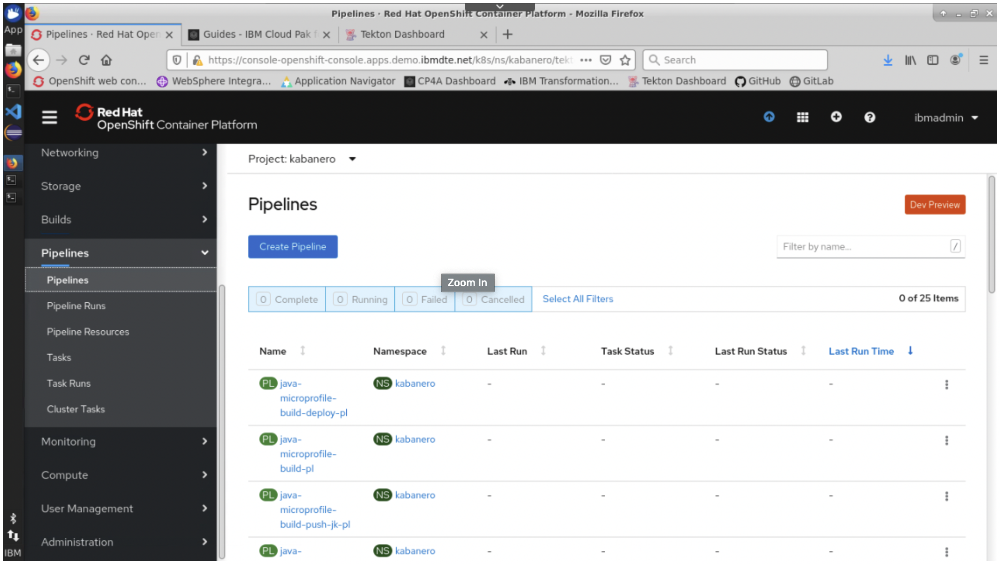  
**Figure 13 - Cloud Pak for Application pipelines in OpenShift pipelines dashboard**

Note that the pipelines match the application stacks available in the `kabanero` repository and that there is more than one pipeline per application stack, addressing different deployment scenarios, such as pipelines for only building the code, pipelines for building and deploying the code, and so on.


#### 3.5.4.1. Using a webhook

As mentioned earlier, the environment used in this lab does not have a public network, so remote source code repositories cannot callback into the environment. However, that is normally how you would initiate a build in a real production environment.

As a post-lab exercise, follow this excellent tutorial, including step-by-step instructions for setting up and exercising webhooks: [https://developer.ibm.com/tutorials/deploy-appsody-to-openshift-with-tekton-pipelines/](https://developer.ibm.com/tutorials/deploy-appsody-to-openshift-with-tekton-pipelines/)


#### 3.5.4.2. Tekton dashboard

The Cloud Pak Applications installer also deploys the Tekton dashboard, from where you can manage pipeline objects such as `PipelineRun`, `PipelineResource`, and webhooks.

You can locate the route to the Tekton dashboard by entering the following command from your terminal:

```sh
oc get route -n tekton-pipelines tekton-dashboard
```

This command should produce an output similar to the one in the line below:

```
NAME HOST/PORT PATH SERVICES PORT TERMINATION WILDCARD
tekton-dashboard tekton-dashboard-tekton-pipelines.apps.demo.ibmdte.net tekton-dashboard <all> reencrypt/Redirect None
```

You can see the route tekton-dashboard-tekton-pipelines.apps.demo.ibmdte.net. Open that URL in a web-browser tab to access the dashboard, which should look like what is depicted in Figure 14.

  
**Figure 14 - Cloud Pak for Application pipelines in Tekton dashboard**

Note the left-navigation bar for the panels associated with each element of the pipelines, as well as the "Namespace" selector. You will notice that many of these panels are also available in the "Pipelines" view of the "Administrator" perspective in the OCP console (Figure 13).

The Tekton dashboard offers a few extra capabilities, especially the ability to create new pipeline resources (source code repositories and target repository for container images) as well as webhooks. These resources contain a lot of fields that are error-prone to type by hand, so that some administrators may prefer to create the resources that way.

You can explore the Tekton dashboard in more detail using the "Build and deploy applications with pipelines" guide, accessible from the "Guides" section of the Cloud Pak console (see section [2.3](#23-cloud-pak-console) - ["Cloud Pak Console"](#23-cloud-pak-console)).


#### 3.5.4.3. Triggering manual runs

A manual build run can be triggered with the creation of a PipelineRun object in the cluster. Before creating that run for each service, you need to create the `PipelineResource` objects for the run.

Take a look at the file `/home/ibmdemo/cp4a-labs/think20/service-a/tekton/service-a-manual-pipeline-run-v1.yaml`, first inspecting the two `PipelineResource` objects, where the first describes the target location for the image created in the pipeline run and the second describes the source location for the code.

```yaml
apiVersion: v1
items:
- apiVersion: tekton.dev/v1alpha1
  kind: PipelineResource
  metadata:
    name: docker-image-service-a-v1
  spec:
    params:
    - name: url
      value: image-registry.openshift-image-registry.svc:5000/cloudlab/service-a
    type: image
- apiVersion: tekton.dev/v1alpha1
  kind: PipelineResource
  metadata:
    name: git-source-service-a-v1
  spec:
    params:
    - name: revision
      value: v1
    - name: url
      value: https://github.com/think-2020-cp4a/service-a.git
    type: git
kind: List
```

Now take a look at the PipelineRun object, cross-referencing the two resources, as well as the pipeline to be used ("nodejs-express-build-deploy-pl").

```yaml
apiVersion: tekton.dev/v1alpha1
kind: PipelineRun
metadata:
  name: service-a-pipeline-run-v1
spec:
  params:
  - name: event-type
    value: push
  - name: event-ref
    value: refs/heads/master
  - name: docker-imagename
    value: service-a
  - name: docker-imagetag
    value: 1.0.0
  serviceAccountName: kabanero-pipeline
  timeout: "1h0m0s"
  pipelineRef:
    name: nodejs-express-build-deploy-pl
  resources:
    - name: git-source
      resourceRef:
        name: git-source-service-a-v1
    - name: docker-image
      resourceRef:
        name: docker-image-service-a-v1
```

Before initiating the pipeline runs, remember that we may have existing workloads deployed from the previous sections, so take a moment to clean up the "cloudlab" namespace entering the following commands on a terminal:

```sh
oc get dc -n cloudlab -o name | xargs oc delete -n cloudlab
oc get svc -n cloudlab -o name | xargs oc delete -n cloudlab
oc get route -n cloudlab -o name | xargs oc delete -n cloudlab
oc get imagestream -n cloudlab -o name | xargs oc delete -n cloudlab
```

Initiate the pipeline runs for each service, entering the commands that will delete any eventual previous run with the same name and start a new one. Note that the pipelines are defined in the `kabanero` namespace, so the pipeline runs will be created in that namespace.

Starting pipeline run for microservice "A":

```sh
cd /home/ibmdemo/cp4a-labs/think20/service-a/tekton

oc delete -n kabanero --ignore-not-found=true -f service-a-manual-pipeline-run-v1.yaml

oc apply -n kabanero -f service-a-manual-pipeline-run-v1.yaml
```

Starting pipeline run for microservice "B":

```sh
cd /home/ibmdemo/cp4a-labs/think20/service-b/tekton

oc delete -n kabanero --ignore-not-found=true -f service-b-manual-pipeline-run-v1.yaml

oc apply -n kabanero -f service-b-manual-pipeline-run-v1.yaml
```

Starting pipeline run for microservice "C":

```sh
cd /home/ibmdemo/cp4a-labs/think20/service-c/tekton

oc delete -n kabanero --ignore-not-found=true -f service-c-manual-pipeline-run-v1.yaml

oc apply -n kabanero -f service-c-manual-pipeline-run-v1.yaml
```

You can follow along the progress of the pipeline runs the "Pipelines" view of the "Administrator" perspective in the OCP console (Figure 15).

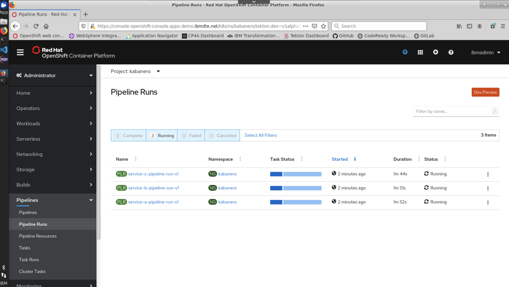  
**Figure 15 - Cloud Pak for Application pipeline runs in OpenShift pipelines dashboard**

You can also inspect the status of pipelines and pipeline runs using the Tekton command-line interface, entering the following command:

```sh
tkn pipelinerun list -n kabanero
```

The command should produce results similar to the ones below:

```
NAME STARTED DURATION STATUS
service-c-pipeline-run-v1 3 minutes ago --- Running
service-b-pipeline-run-v1 3 minutes ago --- Running
service-a-pipeline-run-v1 3 minutes ago --- Running
```

You can also list and monitor the individual tasks inside a run, entering the following command:

```sh
tkn taskrun list -n kabanero
```

This command should show the list of all task runs for pipeline runs, producing an output similar to the one below:

```
NAME STARTED DURATION STATUS
service-a-pipeline-run-v1-build-push-task-2tw5f 4 minutes ago --- Running
service-b-pipeline-run-v1-build-push-task-blxzb 4 minutes ago --- Running
service-c-pipeline-run-v1-build-push-task-zg49x 4 minutes ago --- Running
service-c-pipeline-run-v1-validate-stack-task-7cqq9 6 minutes ago 2 minutes Succeeded
service-b-pipeline-run-v1-validate-stack-task-nh226 6 minutes ago 2 minutes Succeeded
service-a-pipeline-run-v1-validate-stack-task-558ll 6 minutes ago 2 minutes Succeeded
```

You can also look into the logs for an individual task run, entering the following command, being careful to replace the name of the task run with a name in the output of your terminal instead of the one in the example below:

```sh
tkn taskrun logs service-a-pipeline-run-v1-build-push-task-2tw5f -n kabanero
```

The pipelines may take a few minutes to complete because the containers are being built from source code. Use the time to explore the "Pipeline" view in the OCP console, the Tekton dashboard, and the Tekton CLI.

As an additional exercise, list the logs for a couple of Task Run objects using both the Tekton command-line interface and the Tekton dashboard.


# 4. Monitoring the microservices

Day-2 operations begin once the software is deployed and in use by customers, at which point the administration team must have full visibility into the internal and external state of the system.


## 4.1. OpenShift Service Mesh

The OpenShift Service Mesh feature builds upon the Istio foundation to deliver integrated capabilities of the service mesh into the container platform.

You can read about the OpenShift Service Mesh at [https://www.openshift.com/learn/topics/service-mesh](https://www.openshift.com/learn/topics/service-mesh) and you are also encouraged to take the labs specifically designed for learning more about the service mesh at [https://learn.openshift.com/servicemesh](https://learn.openshift.com/servicemesh).

The service mesh intercepts the traffic between pods running in a list of configurable "member roll" namespaces. The service mesh intermediates all communication to monitor and augment the traffic. The monitoring sends all connection information (but not the data) to a database (Prometheus backend) from where various dashboards can offer various perspectives on the data. The augmentation allows the service mesh to control access to services as well as define policies to redirect traffic across pods.

For this lab, you will enable the service mesh to automatically monitor traffic in the "cloudlab" namespace where the microservices are being deployed. The service mesh will have a control plane that is configured with a "member roll" containing that one namespace.

Before you continue, you must ensure you executed the steps in section [2.2.3](#223-patching-the-lab-environment) (["Patching the lab environment"](#223-patching-the-lab-environment)) otherwise the service mesh will not be properly initialized and the commands in this section will not work.

As a first step, clone the repository with the configuration files for the service mesh, entering the following commands:

```sh
mkdir -p /home/ibmdemo/cp4a-labs/think20
cd /home/ibmdemo/cp4a-labs/think20

git clone https://github.com/think-2020-cp4a/monitoring.git
```

Create the target namespace for the service mesh configuration, then create both the `ServiceMeshControlPlane` and the `ServiceMeshMemberRoll` objects that will enable the service mesh in the "cloudlab" namespace.

```sh
oc create namespace istio-system
cd /home/ibmdemo/cp4a-labs/think20/monitoring

oc apply -f smcp.yaml -n istio-system
oc apply -f smmr.yaml -n istio-system
```

We need a newer version of the service mesh for this portion of the lab, so enter the following command to delete the old version:

```sh
oc delete ClusterServiceVersion servicemeshoperator.v1.0.9 \
    --ignore-not-found=true \
    -n openshift-operators
```

Note the content of the `smmr.yaml` file, with a `members` element being a list of namespaces belonging to the service mesh, and the "cloudlab" namespace as the sole member of the service mesh:

```yaml
apiVersion: maistra.io/v1
kind: ServiceMeshMemberRoll
metadata:
  name: default
spec:
  members:
    - cloudlab
```

The creation of these objects triggers the creation of several containers in the "istio-system" namespace and you need to wait until they are all running before proceeding to the next step. You can monitor the status of the pod using the "Workloads -> Pods" view in the "Administrator" perspective of the OCP console, ensuring you have the "istio-system" project selected under the "Project" menu or entering the following command in a terminal:

```sh
oc get pod -n istio-system -w
```

Once you see all containers in a "Running" or "Completed" state, the service mesh starts monitoring the contents of the "cloudlab" namespace and inject a new network proxy container to new pods annotated with `sidecar.istio.io/inject:"true"` in that namespace. This annotation is already present in the `app-deploy.yaml` file for each microservice.


## 4.2. Configure the ingress for the deployed service

You need to restart the pods in the "cloudlab" namespace since they were created before the Service Mesh was configured, entering the following command:

```sh
oc get pod -n cloudlab -o name | xargs oc delete -n cloudlab
```


### 4.2.1. Patch for Appsody Operator issue (already fixed upstream)

There is an issue with the version of the Appsody Operator 0.3.0 deployed in the Cloud Pak for Applications release 4.1 ([https://github.com/appsody/appsody-operator/issues/227](https://github.com/appsody/appsody-operator/issues/227)), which is required until Cloud Pak for Applications picks up version 0.4.0 of the Appsody Operator. In essence, the problem is that the label of the service created for the application is named `tcp-<port>` instead of using the label `http` expected by the service mesh.

Enter the following commands to patch the port label for each service:

```sh
# service-a
oc patch service service-a -n cloudlab \
    -p '{"spec":{"ports":[{"port": 3000, "name":"http"}]}}'
oc patch route service-a -n cloudlab \
    -p '{"spec":{"port":{"targetPort": "http"}}}'

# service-b
oc patch service service-b -n cloudlab \
    -p '{"spec":{"ports":[{"port": 8080, "name":"http"}]}}'
oc patch route service-b -n cloudlab \
    -p '{"spec":{"port":{"targetPort": "http"}}}'

# service-c
oc patch service service-c -n cloudlab \
    -p '{"spec":{"ports":[{"port": 9080, "name":"http"}]}}'
oc patch route service-c -n cloudlab \
    -p '{"spec":{"port":{"targetPort": "http"}}}'
```

### 4.2.2. Routing inbound traffic to the application via Service Mesh

The service mesh requires a `Gateway` and a `VirtualService` object (tied to that `Gateway` object) to inform the Service Mesh about which portion of the traffic should be routed to the application.

```sh
cd /home/ibmdemo/cp4a-labs/think20/monitoring

oc apply -f smingress.yaml -n cloudlab
oc apply -f service-c-fault-injection.yaml -n cloudlab
```

Note the application of the service-c-fault-injection.yaml file, introducing an intermittent failure in all calls to service-c. This artificial failure will be used to illustrate a few points in the next few sections.

Before generating traffic for the exercise, you need to locate the route for the service ingress in the service mesh, entering the following command:

```sh
oc get route istio-ingressgateway -n istio-system
```

The command should produce content similar to the one below:

```
NAME HOST/PORT ...
istio-ingressgateway istio-ingressgateway-istio-system.apps.demo.ibmdte.net ...
```

Now leave this loop running in a separate terminal so that you have a constant stream of traffic to analyze in the next sections:

```sh
for i in {1..2000}
do
    curl istio-ingressgateway-istio-system.apps.demo.ibmdte.net/quoteOrder
    sleep 1
    curl istio-ingressgateway-istio-system.apps.demo.ibmdte.net/quoteItem
    sleep 1
done
```


## 4.3. Grafana console

The Grafana console is the primary mechanism for visualizing application-level metrics for applications running inside OpenShift and is deployed by default when you create a new `ServiceMeshControlPlane` object for the service mesh.

Note that there is already a Grafana console that can be launched with the "Monitoring -> Dashboards" sub-menu in the "Administrator" perspective of the OCP console, but that console is locked down for monitoring of the OCP console itself.

To access the Grafana console for the service mesh, find its route with the following command:

```sh
oc get route grafana -n istio-system
```

The command should produce content similar to the one below:

```
NAME HOST/PORT ...
grafana grafana-istio-system.apps.demo.ibmdte.net ...
```

Launch the console using the "host/port" in the above output:

[https://grafana-istio-system.apps.demo.ibmdte.net](https://grafana-istio-system.apps.demo.ibmdte.net/)

You will likely be prompted to accept the risk of opening the self-signed certificate for this air-gapped system. You will also be prompted to log in to OpenShift, following the instructions from section [2.2.1](#221-logging-into-the-red-hat-ocp-console) (["Logging into the Red Hat OCP console"](#221-logging-into-the-red-hat-ocp-console)).

Now select the "Explore" button on the left navigation bar of the Grafana console, type the following expression in the field labelled `Enter a PromQL query`, then press Enter:

```
avg by (destination\_service\_name, destination\_version, response\_code)(rate(istio\_requests\_total{destination\_service\_namespace="cloudlab"}[5m]))
```

You should see a screen similar to Figure 16.

  
**Figure 16 - Graph with traffic data over time for the microservice architecture**

As a last exercise with Grafana, select "Dashboards" from the left menu again and click on the "Manage" button, then click on the "Import" button. In the "Import" panel, select "Upload .json file" and select the file "GrafanaLabDashboard.json" in the "monitoring" project you cloned at the beginning of this section, located at "/home/ibmdemo/cp4a-labs/think20/monitoring/GrafanaLabDashboard.json".

You should see a dashboard similar to the one in Figure 17.

  
**Figure 17 - Dashboard for metrics generated in this tutorial**

After the lab, you can follow this tutorial on how to include application metrics into a Grafana dashboard: [https://developer.ibm.com/technologies/microservices/tutorials/configure-an-observable-microservice-with-appsody-openshift-open-liberty/](https://developer.ibm.com/technologies/microservices/tutorials/configure-an-observable-microservice-with-appsody-openshift-open-liberty/). It is based on the Open Liberty application (service-c)


## 4.3. Kiali console

The Kiali console ([https://kiali.io/](https://kiali.io/)) is an observability and configuration console for the service mesh. It can graph the traffic for health and performance of the network communication, as well as browsing and modifying service configuration to match the workload needs.

You can find the route for the Kiali console entering the following command:

```sh
oc get route kiali -n istio-system
```

The command should produce content similar to the one below:

```
NAME HOST/PORT ...
kiali kiali-istio-system.apps.demo.ibmdte ...
```

Launch the Kiali console using the "Host/Port" field: [https://kiali-istio-system.apps.demo.ibmdte.net](https://kiali-istio-system.apps.demo.ibmdte.net/), which should look similar to Figure 18.

You will likely be prompted to accept the risk of opening the self-signed certificate for this air-gapped system. You will also be prompted to log in to the OCP console, following the instructions from section [2.2.1](#221-logging-into-the-red-hat-ocp-console) (["Logging into the Red Hat OCP console"](#221-logging-into-the-red-hat-ocp-console)).

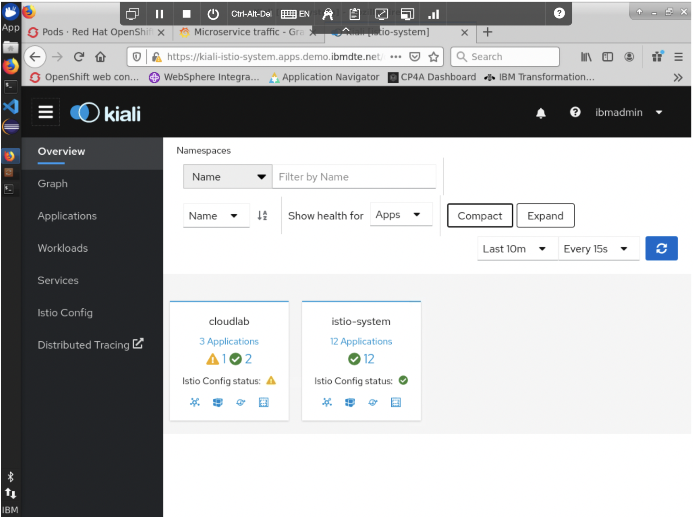  
**Figure 18 - Overview of applications in service mesh, illustrating degraded status for the applications in the "cloudlab" namespace**

Note the degradation in the applications you just deployed, which was artificially injected into the communication through the service mesh "fault injection" capability. After the lab, you are encouraged to learn more about all other networking capabilities available in the service mesh, reading through and applying the examples available at [https://istio.io/docs/concepts/traffic-management/](https://istio.io/docs/concepts/traffic-management/) .

Now select the "Graph" view from the left navigation bar and make the following configuration changes to see the traffic in Figure 19:

- Select "cloudlab" in the "Namespace" field
- Choose "App graph" and "Requests per second" in the drop-down menus under the "Graph" label
- Select the "Traffic animation" box in the "Display" drop-down menu under the "Graph" label
- Enter "name=unknown" in the "Hide..." field (this out the "unknown" node monitoring the health of the services)

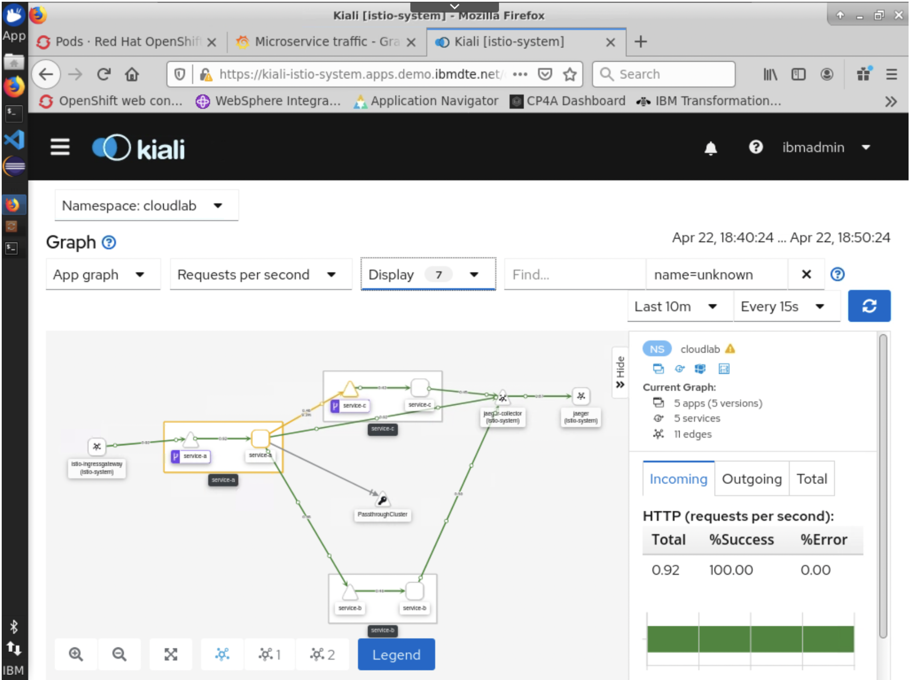  
**Figure 19 - Graph of application traffic showing degradation in calls from service-a to service-c**

Note how you can see the cause of the degradation called out in the "Overview" page, in the traffic between "service-a" and "service-c".

After the lab, you are encouraged to look at the Kiali documentation for more information about other monitoring capabilities, at [https://kiali.io/documentation/runtimes-monitoring/](https://kiali.io/documentation/runtimes-monitoring/).


## 4.4. Jaeger console

Jaeger is a complete system for collection, storage, and analysis of distributed tracing information within a system and is installed with Cloud Pak for Applications.

You can also find the route for all newly created consoles included in the Service Mesh, entering the following command:

```sh
oc get route jaeger -n istio-system
```

The command should produce content similar to the one below:

```
NAME HOST/PORT ...
jaeger jaeger-istio-system.apps.demo.ibmdte.net ...
```

You can either launch the console entering the URL returned in the "Host/Port" field (https://jaeger-istio-system.apps.demo.ibmdte.net) or clicking on the "Distributed Tracing" link in the left navigation bar of the Kiali console. You should see a screen similar to the one depicted in Figure 20.

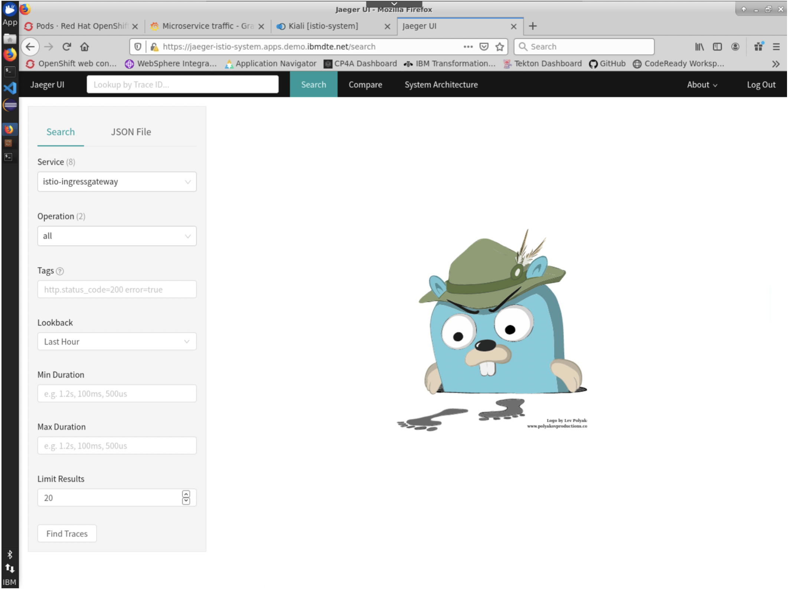  
**Figure 20 - Jaeger UI main page, still empty until a search is executed**

Now you can search the trace entries created by the traffic in the microservice architecture. Recall that all the traffic was placed inside the mesh and accessed through the "istio-ingressgateway" service, so select that service in the "Service" drop-down field and click on the "Find Traces" button, which should display search results like the ones seen in Figure 21.

  
**Figure 21 - Trace results in Jaeger UI for transactions started in the Service Mesh ingress gateway**

Notice that some of the trace entries have labels indicating errors in the tracing, due to the artificial introduction of faults using the service mesh capabilities earlier on. Click one of those traces and expand the error line in the "Service & Operation" column, which displays the simulated failure in the calls to "service-c" (Figure 22).

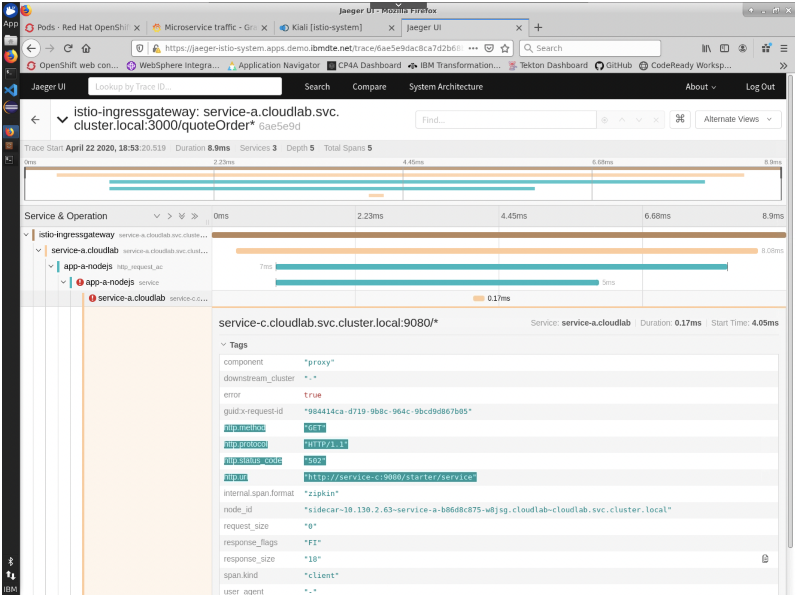  
**Figure 22 - Drill-down of trace entry to inspect causes of error in a business transaction**


# 5. Conclusion

After this lab, you have gone through the core concepts of how to package, deploy, and operate applications using the "Accelerator for Teams" component of the Cloud Pak for Applications:

Part 1 - Build and Deploy

- Building application containers using the Appsody command-line interface
- Deploying applications using the Appsody command-line interface
- Deploying applications using the OpenShift command-line interface
- (post-lab suggestion) Deploying applications using webhooks into pipelines
- Deploying applications using manually created pipeline runs

Part 2 - Monitor

- Enable the OpenShift Service Mesh in the cluster
- Inspect application metrics on Grafana console
- Inspect application traffic on Kiali console
- Inspect application traces on Jaeger console
